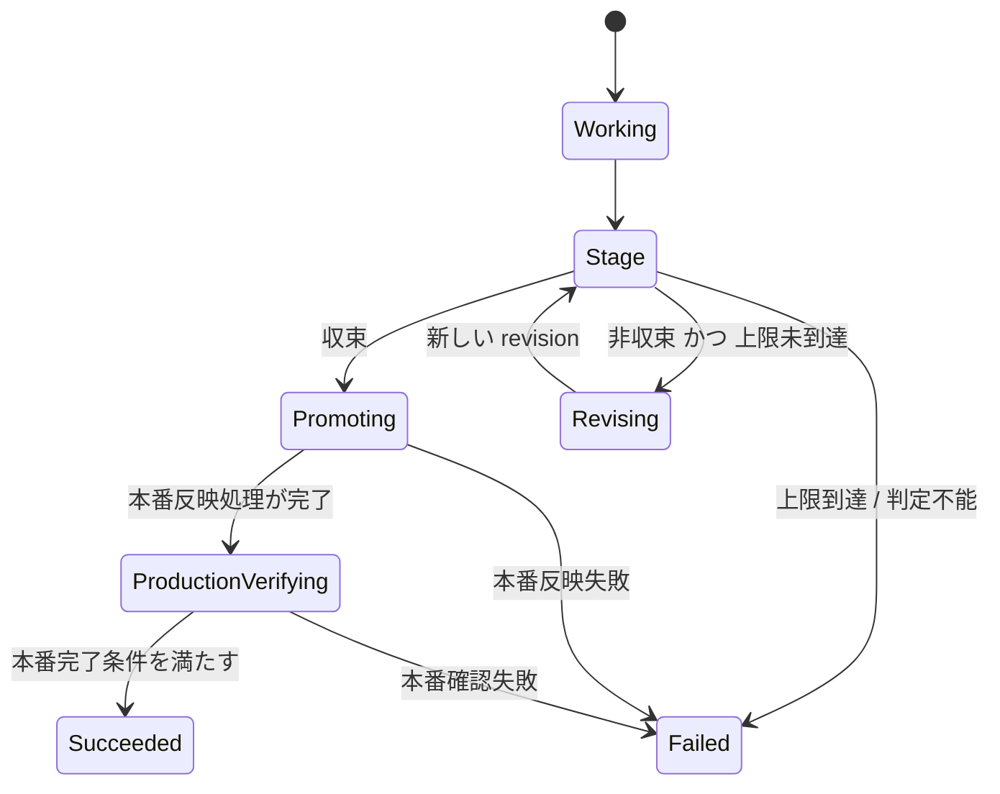
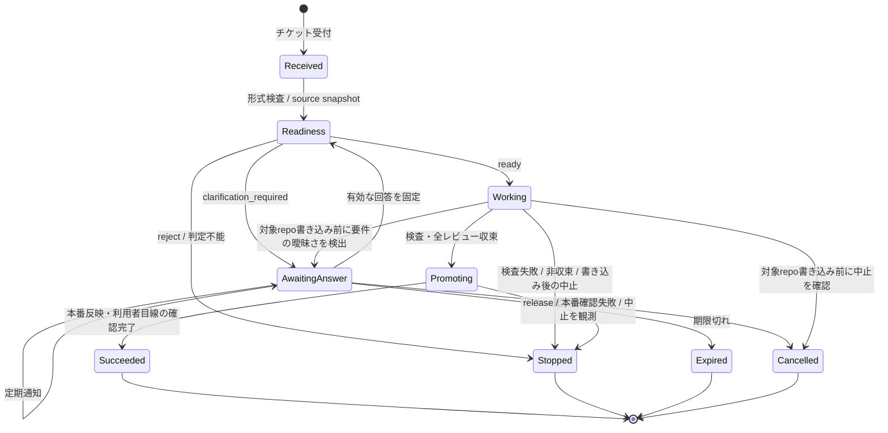
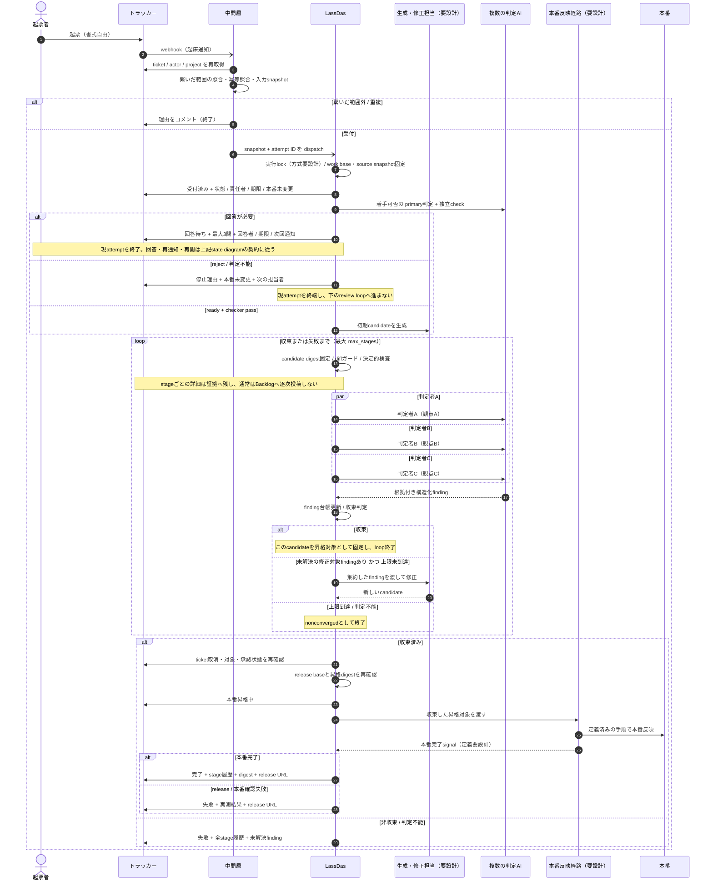

# LassDas

**トラッカーにチケットを切るだけで、AI が実行し、独立した検査を通ったものだけが指定した納品先まで届くフレームワーク。人がやるのは、依頼を書くことと、聞かれたら答えることだけ。**

**どこまで無人で進めるかは設定で決める。**

| 納品先の設定 | 無人で進む範囲 | 人がやること |
|---|---|---|
| 納品先ブランチへの PR 提示 | 依頼 → 実装 → レビュー → 検査 → PR | PR を見てマージする |
| 統合ブランチ（例: stg）まで | 上記 + マージ + stg 反映の確認 | 本番へ出すかを判断する |
| 本番まで | 全部 | なし（聞かれたら答えるだけ） |

**最大値は本番自動反映。PoC の既定は「納品先ブランチへの PR 提示まで」とする。** 納品先より先へ進めるかどうかは設定であり、フレームワークの前提ではない。

**書式は要求しない。** 起票された依頼をそのまま受け取り、読めない部分は起票者に質問する。**入力が形式に合わないことを理由に弾かない。**

**質問は原則として選択肢で出す。** 起票者が 1 行で答えられる形にし、考える作業を押し戻さない。自由記述で問い返すのは、選択肢を立てられないことが明確な場合に限る。選択肢を出せるということは、**システム側が取りうる案を洗い出し終えている**ということでもある。洗い出せていないまま「どうしますか」と聞くのは、判断を丸投げしているだけになる。

### 最小限の設定

「宣言」ではなく「繋ぐ」だけを求める。

1. トラッカーの webhook を向ける
2. GitHub App を触らせたいリポジトリに入れる — **入れた範囲がそのまま触ってよい範囲**
3. モデルの接続先
4. **納品先** — どのブランチへ、どこまで進めるか（PR 提示 / 統合ブランチまで / 本番まで）

起票者・対象ファイル・変更の種類・完了条件を事前に登録させない。すべて依頼ごとに決まり、決められなければ聞く。**設定するのは「どこへ届けるか」だけで、「何をどう書くか」ではない。**

### フレームワークが所有するもの

エージェントの賢さを競うものではない。エージェントと判定者はいずれも非決定的であるという前提に立ち、**どの AI 群で何段までレビューし、何をもって収束とし、どの成果物を納品先へ渡し、失敗時に何を残すか**をフレームワーク側が契約として所有して執行する。**入力の形は所有しない。納品先をどこにするかも所有しない**（設定で決まる）。所有するのは「そこへ渡してよいと判断する規則」である。

1 ステージでは、同一の成果物を設定済みの複数 AI へ同時に渡して独立に敵対レビューさせる。修正対象の指摘があれば新しい成果物を作って次のステージへ進み、既定の最大ステージ以内に収束すれば本番へ反映する。収束しなければ本番へは進めず、各ステージの指摘・修正・未解決事項をレポートして失敗終了する。**本番へ反映する具体的な経路は要設計**であり、現時点では消費 repo の既存リリース経路を使う案を最小候補とする。

これが無ければ「人手を挟まず本番へ」は成立しない。**「AI が賢いから任せる」のではなく、「人間がレビューで見ていたものを機械が見ている」から任せる。**

### 入力について

実際のチケット（第 1 号インスタンスの実チケット 2 枚。番号はインスタンス repo の docs に記録）には、背景・問題の列挙・完了条件（案）・前提・放置した場合の影響が高い確率で含まれている。同じ規約で起票されているためである。システムはこれを読む。**含まれていることを要求はしない。**

固定ヘッダで書かせようとしていたものは、既にチケット本文に書かれている。場所が違うだけである。

| ヘッダで要求していたもの | チケット本文のどこにあるか |
|---|---|
| 変更前後の文言 | 完了条件（案） |
| 対象ファイル | 背景に添えられた証拠（画面名・実際に出ている文字列・リクエスト ID） |
| 変更の種類 | 問題の性質から読める |
| 着手可否 | 本文の宣言（例:「TICKET-450 が先行または同時」） |

チケットが前提条件を宣言している場合、できる範囲を実施し、できない部分を理由付きでトラッカーへ返す。**依頼の一部だけ進めて残りを返すことを、失敗として扱わない。**

> **設計ドラフト**: 本番昇格の出口と、有限段の敵対レビューを使うことは合意済み。収束条件、修正担当、既定ステージ数、判定者の必要数、本番反映後の完了条件は未設計であり、本 README で確定事項として扱わない。
>
> 本文では、ユーザーと確認できた内容を**合意済み**、安全性と実装可能性から追加した案を**設計提案**、まだ選択肢を比較していないものを**要設計**として区別する。

---

## 導入 (新しいプロジェクトへ)

```
git clone <この repo> && cd <clone>
./setup.sh
```

対話ウィザードが、インスタンス repo・受け口 (クラウド)・トラッカー接続・動作確認までを一気に組み上げる。全段冪等で、中断しても同じコマンドで続きから再開する。詳しい前提と各段の中身は [docs/TICKET_AUTHORING.md](docs/TICKET_AUTHORING.md) と `cmd/setup` を参照。

## 現在の状態

| 項目 | 状態 |
|---|---|
| 製品の出口 | **設定可能**（合意済み 2026-08-05）。納品先ブランチへの PR 提示 / 統合ブランチまで / 本番まで。最大値は本番自動反映 |
| PoC の出口 | **納品先ブランチへの PR 提示まで**（合意済み 2026-08-05） |
| 本番昇格ゲート | 複数 AI の敵対レビュー → 修正を有限ステージで反復（合意済み） |
| 収束条件 | **要設計** |
| 本番反映の契約 | **要設計**（反映経路・対象 candidate・完了確認・失敗時処置） |
| 入力契約 | **再設計中** — 書式を要求せず受け取り、不足は選択肢で質問する形へ。固定 M1 は現在も固定ヘッダを要求し、合わなければ**質問せずに弾く**（実装が本 README の前提と逆を向いている） |
| 骨格 | **再設計中** |
| 外部仕様の検証 | 一部未了（[実装前に確認すること](#実装前に確認すること)） |
| 契約の定義（`docs/`） | **未作成** |
| 固定 M1 実装 | 中央 repo に実装済み。ただしチケット受信は無効で、本節の UX / semantic readiness は未実装 |
| 汎用フレームワーク | **未実装・未証明**。固定 M1 の手動設計を汎用実装と数えない |
| 第 1 号の組み合わせ | トラッカー = Backlog / 消費 repo = 第 1 号の console repo（実名はインスタンス repo の設定） / モード = `client-visible-change` |
| 公開範囲 | public（2026-08-17 公開） |

固定 M1 の縦通しコードは存在するが、まだチケット受信を有効化しておらず、本 README で新たに定義した UX / semantic readiness も実装していない。旧設計の「出口は PR」「一度の敵対レビューで合否を決める」という前提は撤回し、本番自動反映を成立させる契約として再設計する。**「フレームワーク」を名乗れるかは、2 番目の消費者と 2 番目のトラッカーが繋がって初めて事実になる。**

---

## 立ち位置

LassDas の利用者に見える結果は、**Backlog のチケットから本番反映までが、人手によるチケットごとの承認なしに進むこと**である。本番反映を LassDas 自身がどこまで所有するか、既存経路へ何を渡すかは要設計。

### 既存基盤が埋めている領域（自前で作らない）

GitHub Agentic Workflows（gh-aw、GitHub 公式）は、エージェントの実行時の安全性について次を実装している。

> "agents run read-only and request actions via structured output, while separate permission-controlled jobs execute those requests"
> "This provides least privilege, defense against prompt injection, auditability, and controlled limits per operation."
> — [gh-aw / safe outputs](https://github.github.com/gh-aw/reference/safe-outputs/)

エージェントを読み取り専用で動かし、書き込みは権限を分けた別ジョブが行う。秘密情報はエージェントのプロセスの外に置かれる。**この境界を自前で作り直す理由はない。** LassDas はこの層を既存基盤に委ね、可能な限りその上に乗る。

**設計提案**: 本番への反映は、消費 repo ごとの正規リリース経路へ収束した成果物を渡す。LassDas が新しい release controller、deploy workflow、IAM / RBAC、branch governance、rollback 基盤まで所有する案は、必要性・影響範囲・rollback / retirement を示したうえで、ユーザーからその変更に対する明示的な個別承認を得るまで採用しない。独立レビューはこの拡張を承認できない。

### LassDas が扱う領域

**外部チケットから本番反映までの制御流と、本番へ進める成果物を決める有限段の収束ゲート。**

1. **外部トラッカー起点** — GitHub イベント以外を入口にする（第 1 号は Backlog）
2. **成果物の生成と修正** — AI が候補を作り、敵対レビューの指摘を受けて次の revision を作る
3. **有限段の敵対レビュー** — 同一 revision を複数種類のフロンティア AI へ同時に渡し、最大ステージまで反復する
4. **本番昇格の執行** — 収束した candidate だけを、要設計の本番反映経路へ渡す
5. **失敗の可視化** — 非収束、判定不能、実行障害、リリース障害を区別し、各ステージの履歴とともにトラッカーへ返す
6. **利用者環境への配備（設計提案）** — チケットの受け口は利用者が自分の環境にデプロイする

### 正直な範囲

- 本番へ自動反映するからといって、複数 AI のレビューが正しさを証明するわけではない
- 収束条件は未設計であり、「全員が指摘ゼロ」を含む候補をまだ比較・検証していない
- **設計提案**: 既存の正規リリース経路が自動本番反映を許さない場合、別経路での迂回を自動選択しない
- **設計提案**: 既存経路の変更が必要なら、本フレームワークの通常実装とは分け、影響範囲と復旧方法を示してユーザーの個別承認を得たうえで判断する
- 固定 M1 のコードは存在するが、チケット受信は無効で、本節の UX / semantic readiness を含む縦通しは未実証である

---

## 本番昇格ゲート（設計ドラフト）

本番への昇格は、一度のレビュー結果では決めない。**同一 revision への並列敵対レビュー、指摘に基づく修正、全判定のやり直しを、有限の最大ステージまで繰り返す。**

**入力の形を所有しない設計では、この敵対レビューが線を守る唯一の機構になる。** 以前は「決まった書式・2 ファイル・120 行」という入口の枠が実質的な安全装置を兼ねていた。その枠を外す以上、**成果物を見て止める側の重みが増す。** 敵対レビューは省略可能な付加機能ではなく、無人で本番へ出すことの根拠そのものである。



### 1 ステージの定義

| 項目 | 区分 | 内容 |
|---|---|---|
| 入力 | 合意済み | そのステージで固定された同一の candidate。revision / artifact digest のどれで固定するかは要設計 |
| 判定者 | 合意済み | 複数種類のフロンティア AI。具体的な集合と version は要設計 |
| 実行 | 合意済み + 設計提案 | 全判定者へ同時に投入することは合意済み。判定者どうしの出力を隠すかは設計提案 |
| 出力 | 設計提案 | 根拠を伴う構造化された指摘、または明示的な「指摘なし」 |
| 修正 | 合意済み + 要設計 | 修正対象の指摘後に新しい candidate を作り、次 stage で再レビューする。何を修正対象とするか、誰が統合・修正するかは要設計 |
| 上限 | **確定 (2026-08-06)** | 有限の `max_stages` を置く。**既定 3 で確定** — 反復修正の利得は 2 ラウンドで 76〜95% が飽和するという実証 (内部調査、非公開) に基づく。実装も 3 |
| 上限到達 | 合意済み | 本番へ進めず、非収束の内容をレポートして失敗終了 |

本番へ反映するのは、収束判定を受けた candidate と対応する成果物である必要がある。ただし、**同一性を commit SHA、tree hash、artifact digest のどれで表すか、rebase・merge・build 差分をどこまで別 candidate とみなすかは要設計**。厳密な digest 一致と、差分発生時の全ゲート再実行は設計候補とする。

### 収束条件（要設計）

「全判定者の指摘がゼロ」は最も単純な候補だが、採用は未決定。複数の非決定的な AI は、新しい指摘、重複、相反する提案、深刻度の揺れを出し続ける可能性があるため、実際に有限段で使えるかを検証して調整する必要がある。

次は収束ポリシーを設計する際の検討候補であり、採用は未決定。

- ステージをまたいで同じ指摘を識別する方法
- どの指摘を本番昇格のブロッカーとして数えるか
- 指摘を「修正済み」「根拠付きで棄却」「重複」「未解決」に閉じる方法
- 新しいブロッキング指摘が何ステージ出なければ安定とみなすか
- 判定者どうしの指摘が衝突した場合の停止条件
- 修正と再指摘が往復する oscillation の検出
- 根拠のない指摘、再現不能な指摘、軽微な指摘の扱い
- 必須判定者の無応答、schema 不正、provider 障害の再試行と失敗条件
- 重複の統合と低確信 finding の破棄をどの段階で行うか（商用前例: 並列判定の後段に集約役を置き、重複除去と低確信破棄を行ってから提示する）
- 単独の判定者だけが出した指摘の扱い（多数決で棄却するか、再検証してから数えるか）

**設計提案**: 収束ポリシーはモデルへの自然言語指示だけにせず、ステージ履歴から同じ結論を再計算できる構造化された規則として持つ。

**設計提案**: M1 の `max_stages` は安全な暫定上限として 3 を置き、実測（stage 履歴・非収束率・費用）で調整する。上限到達時は現行方針どおり人間へ報告して停止する。参考値: 同一モデルの自己修復では利得の大半（76〜95%）が最初の 2 ラウンドで飽和するという測定と、商用製品が自動修正の試行を PR あたり 3 回に制限している前例（競合調査 (内部調査、非公開) §5.3, §6）。**いずれも異種ベンダー敵対レビュー収束の直接証拠ではない**（これを直接検証した公開研究は、競合調査の範囲では確認できなかった）。

### 判定者の実行条件（既存知見に基づく設計提案）

| 条件 | 理由 |
|---|---|
| **判定者に過去の議論や他の判定者の出力を渡さない** | 既存判断への追認と相互誘導を避ける |
| **全判定者に同一 revision を渡す** | 異なる成果物への指摘を同じ票として集計しない |
| **観点を判定者ごとに定義する** | 同じ指示の反復で盲点を相関させない |
| **出力 schema を固定する** | 指摘、根拠、深刻度、対象箇所をステージ間で追跡できるようにする |
| **「指摘なし」も明示させる** | 無応答と問題なしを区別する |
| **判定者の vendor / model / version を記録する** | `frontier` という呼称だけで実行内容を曖昧にしない |
| **candidate を生成したモデルと同ベンダーの判定者だけで必須集合を構成しない** | モデルは自分が書いたコードのレビューが他ベンダーのコードより弱いという商用実測と、同質モデルの合議は誤差が相関して実効票が減るという研究があるため（競合調査 §3.2, §3.5） |

**設計提案**: 応答しなかった判定者を「指摘ゼロ」として扱わない。必要な応答が規定回数の再試行後も揃わなければ、少なくともそのステージは収束扱いにしない。実行全体を即失敗にするか、ステージ上限へ含めるかは要設計。

**設計提案**: レビュー対象の成果物は、判定者への指示ではなく外部データとして扱う。成果物中の命令に従わないよう分離するが、これは緩和策であり機械保証ではない。

### 決定的検査の位置づけ（要設計）

テスト、schema 検証、画面アサーションなどの決定的検査は、書ける仕事では利用する。ただし、これを本番昇格の最終判断とするのか、各 revision の事前条件とするのか、敵対レビュー後にも再実行するのかは未決定である。

**設計提案**: 決定的検査に失敗した revision を本番へ進めず、修正後は検査をやり直す。

**設計提案**: 決定的検査の合格を収束判定の必須条件として契約に明文化する（敵対レビューの指摘が尽きたことだけを本番昇格の根拠にしない）。現行の M1 実装は、レビュー収束後の決定的検査に合格しなければ昇格しない構成を既に持つため、これは実装の追加ではなく、その性質を収束契約の定義へ固定するものである。根拠: 無人反映が既に受容されている領域（依存更新の automerge、merge 後の continuous deployment）はいずれも機械検証・小さい変更・即時可逆性で成立しており、レビューの質を根拠に無人化した前例は確認できない。また修復率はエラー種別で二極化し（表層エラー約 77% に対し assertion 系約 45%）、指摘の消滅だけでは直りにくい欠陥の残留を検出できない（競合調査 §5）。

**設計提案**: 安価な決定的検査（静的解析・テスト実行）を LLM 判定の前段に置き、機械で落とせる candidate に判定者費用を使わない（商用レビュー製品は静的解析の併走やサンドボックスでのテスト生成・実行を先行させている — 競合調査 §6）。これは費用最適化の再構成であり、M1 の必須修正ではない（M1 対象外）。

### 人間の役割

**合意済み**: 正常系では、チケットごとの人間による PR approve、merge、deploy 操作を本番昇格の必須条件にしない。

**設計提案**: 人間の判断を前段へ移し、自動本番反映を許す mode、対象 repo / environment、変更可能範囲、本番反映経路、停止条件を事前に承認する。

**設計提案**: 上限到達、判定不能、scope 拡大要求、本番反映失敗、本番確認失敗は自動で別経路へ迂回せず、人間へ報告して停止する。

### モード登録の公理（ドラフト）

> **有限の本番昇格契約を持たない仕事は、無人で本番へ出さない。**

**これは入口で弾く条件ではない。** 依頼は必ず受け取る。契約を満たせない場合に止まるのは本番へ出す直前であり、そこまでに分かったことと、なぜ出せないかを報告する。「登録できない仕事」という概念を持たない。

この公理自体と各欄の採用は要合意。現時点の候補では、判定者集合、最大ステージ数、収束ポリシー、変更可能範囲、自動反映の対象外領域（例: スキーマ変更、認証・決済 — 国内で AI レビューのみの自動マージを運用する事例も、この種の高リスク領域は人間に残している。競合調査 §8）、成果物の同一性、本番反映経路、本番完了条件、可逆性（rollback 手順と stop owner が実在すること）、失敗時の停止と報告を定義する。収束ポリシーと本番反映契約が未設計なので、モード登録の契約も未完成である。

---

## アーキテクチャ: 3 軸差し込み

以下はアーキテクチャ候補であり、まだ合意済みの製品仕様ではない。本体（`core/`）は制御流と契約の執行だけを持ち、固有値を含まない案を置く。

| 差し込み軸 | 何を決めるか | 第 1 号 | 追加時の作業 |
|---|---|---|---|
| **トラッカー** | 依頼がどこから来て、どこへ報告するか | Backlog | 変換係ファイル 1 枚 |
| **モード** | 変更の性質ごとの上限と本番昇格契約。**起票者が宣言するものではなく、依頼から判定した結果** | `client-visible-change` | モード定義ファイル 1 枚を意図するが未実証 |
| **消費 repo** | 何を直すか・どう検査し、どの経路で本番へ反映するか | （第 1 号: console repo）| 設定 + 検査 + 本番反映経路への接続 |

「変換係 1 枚で済む」は設計上の意図であり、**2 番目の接続で本体に改修が要る可能性は残る**（[正直な限定](#正直な限定)）。

```
LassDas/
  core/            制御流・ステージ進行・収束判定・本番昇格契約の執行
  modes/           モード定義（第 1 号: client-visible-change）
  trackers/        トラッカー変換係（第 1 号: Backlog）
  config/          消費者ごとの repo・判定者・本番反映経路の接続設定
  docs/            契約の定義 ※ 未作成
```

`config/` を `core/` の外に分けているのは、トラッカーと対象 repo の対応づけが固有値の塊であるため（[境界検査](#フレームワーク自身の受入条件)の対象と一致させる）。

**設計提案としての境界**: `core/` は既存の本番反映経路を採る場合、その起動と結果観測だけを担い、branch 操作、deploy 順序、rollback、approval の仕組み自体は所有しない。既存経路で要件を満たせず、この境界を越えて共有 release 基盤を作る場合は、影響範囲・最悪時の影響・rollback / retirement を示し、ユーザーの明示的な個別承認を別途得る。

---

## 保証と緩和策の区別

**機械が執行するもの**と、**そうでないもの**を分ける。この区別を曖昧にすると、宣言が保証に見えてしまう。

### 合意済みの目標保証

- **収束条件を満たさなければ本番昇格を開始しない**
- **最大ステージ数を超えてレビュー・修正を続けない。** 上限到達時は本番を変更せず失敗報告する
- **各ステージの全判定者は同一 revision / artifact digest を評価する**
- **上限到達時は各ステージの指摘・修正・未解決事項を報告する**

### 実装後の保証にする設計提案（要合意）

- **本番へ渡す成果物は、収束判定を受けたものと同一である**
- **修正のたびに許可範囲、決定的検査、必要証拠をやり直す**
- **許可ファイル範囲外の変更は、生成コードを boot する前に検出して中止する**
- **必須判定者の応答が揃わないステージを収束扱いにしない**
- **正規リリース経路が失敗した場合、別経路や直接反映へ自動で迂回しない**
- **実行開始時の入力スナップショットを記録し、本番昇格直前に取消・対象・承認状態と release base を再確認する**
- **報告は機械出力で組み立て、各ステージの revision・判定者・指摘・修正・結果を残す**
- **消費側は固定 tag / SHA で LassDas を pin する**

### 緩和策にとどまるもの（保証と呼ばない）

- **エージェントに git 操作をさせない** — `actions/checkout` の `persist-credentials` は**既定 true** で、トークンがローカル git 設定に書き込まれ、同一ジョブ内の任意プロセスが push できる（[actions/checkout](https://github.com/actions/checkout)）。既定を打ち消す設定と、既存基盤の権限分離に乗ることで初めて執行になる。**それまでは緩和策**
- **プロンプトによる禁止事項** — 統計的な傾向であり機械執行ではない
- **エージェントに渡す能力の最小化** — 許可ツールは消費側設定なので、コアが上限を持たない限り推奨値にすぎない
- **`boot` と判定コマンドの中身** — いずれも消費側の任意コード。許可範囲内のファイルが `boot` で実行される経路は残る
- **複数 AI が収束したという事実** — 成果物の正しさや本番事故が起きないことの証明ではない

---

## モード定義

以下は契約の形を検討するための例であり、schema は未確定。

```yaml
# modes/<mode>.yml
name: <mode-id>
label: <トラッカーに表示する仕事名>
# 起票者に書かせる必須欄は持たない。モードは依頼から判定した変更の性質であり、
# 起票者が宣言するものではない。
limits:
  files: from_consumer
  max_turns: { max: 30 }
  timeout_minutes: { max: 60 }
  max_stages: 5                     # 例。既定値は要設計
gates:
  deterministic:
    command: from_consumer          # 位置づけと反例契約は要設計
  staged_review:
    participants: from_consumer
    lenses: [<lens-a>, <lens-b>, <lens-c>]
    convergence_policy: TBD
    retry_limit: TBD
revision:
  strategy: TBD                     # 指摘を誰がどう次 revision へ反映するか
evidence:
  include_stage_history: true
promotion:
  established_path: from_consumer
  production_verification: from_consumer
  on_failure: stop_and_report
```

`max_stages` を有限にすること以外の上限・再試行・失敗処理は設計提案である。

- `max_stages`、判定者数、時間、token、費用、再試行はすべて有限上限を持つ
- 上限を実行中に自動延長したり、応答しない判定者を黙って外したりしない
- `on_failure` は別の release path へ迂回せず、停止と報告を既定にする
- 判定者が要求した修正が許可範囲を越える場合、自動で scope を広げず失敗報告する
- 収束ポリシーと本番反映契約が決まっていない性質の変更は、無人で本番へ出さない（依頼の受付は拒否せず、本番へ出す直前で止めて報告する）

---

## トラッカー変換係

以下は設計提案。認可方式と論理状態はまだ合意していない。

本体がトラッカーに求める操作は 4 つ。

```
受信: webhook を起床通知として受け、トラッカー API から正本を再取得し、
      繋いだ範囲（webhook を向けた project）内であることだけを確認して共通形式へ変換する
      { ticket_id, project, mode, fields, requester, target, idempotency_key, snapshot }

送信: コメントと通知を書く / 対応可能な場合だけ状態を変える・ファイルを添付する
```

- **認証と受け口の防御は変換係の責務。** トラッカーごとに事情が違う（署名の有無、トークン、IP 制限）。Backlog webhook 自体を本番権限として信用せず、ticket・actor・project・mode・target を API から再取得して照合する
- **状態名は本体内部の論理名で扱う。** 本体には少なくとも「開始」「作業中」「回答待ち」「レビュー中」「本番昇格中」「完了」「失敗」が見える。M1 の利用者向け正本は通知付きコメントとし、トラッカーに安全な既存 status がある場合だけ表示目的で対応付ける
- **機能差は変換係が申告し、本体が代替に落とす。** 例: 添付できないトラッカーでは証拠を CI リンク掲載に切り替える。**代替に落ちた場合は報告にその旨を明記する**（契約の強度が接続先ごとに変わることを隠さない）
- **コメントと指定利用者への通知ができず、静かな失敗を防ぐ代替もないトラッカーは登録できない。** status 変更能力だけを必須条件にはしない
- **許可は「繋いだ範囲」で決まる。別の許可リストを持たない。** どの project の webhook を向けたか、どのリポジトリに GitHub App を入れたかが、そのまま許可範囲になる。起票者を個別に登録させない — トラッカー側にチケットを立てられること自体が既に認可であり、二重管理は設定を増やすだけで安全性に寄与しない（webhook は起床通知としてしか使わず、チケットの正本は API から取り直すため、偽の webhook では何も注入できない）

接続設定（`config/` に置く。`core/` ではない）:

```yaml
projects:
  <プロジェクトキー>:
    tracker: <変換係名>
    repo: <対象リポジトリ>
    workflow: <起動する workflow ファイル名>
    status_display:                 # optional。既存statusへ安全に対応付けられる場合だけ
      trigger: <開始状態の実名>
      running: <処理中状態の実名>
      reviewing: <レビュー中状態の実名>
      promoting: <本番昇格中状態の実名>
      succeeded: <完了状態の実名>
      failed:  <失敗状態の実名>
```

**必須欄・起票者リスト・対象リストは持たない。** チケット本文をそのまま読む。触ってよいリポジトリは GitHub App のインストール範囲で決まる。

---

## 消費 repo 設定

以下は接続契約を検討するための設計例であり、schema と各欄の採用は未決定。

```yaml
# .ai-pipeline.yml
repository: <canonical owner/repo>
modes:
  <mode-id>:
    work_base: <作業を開始する正規 branch / revision>
    boot: <アプリを起動するコマンド>
    verify: <決定的判定コマンド>
    allow_files: ["<エージェントが触ってよい glob>"]
    allow_tools: ["<エージェントに許すツール>"]
    artifacts: <成果物ディレクトリ>
    agent_prompt: <repo 固有知識を書いたプロンプトファイル>
    max_turns: 15
    timeout_minutes: 30
    staged_review:
      max_stages: 5                  # 例。既定値は要設計
      participants:
        - id: <reviewer-a>
          vendor: <vendor-a>
          model: <model-and-version>
          endpoint_secret: <endpoint secret 名>
          api_key_secret: <key secret 名>
          lens: <担当観点>
          required: true
        - id: <reviewer-b>
          vendor: <vendor-b>
          model: <model-and-version>
          endpoint_secret: <endpoint secret 名>
          api_key_secret: <key secret 名>
          lens: <担当観点>
          required: true
      convergence_policy: TBD
      revision_strategy: TBD
    release:
      established_path_ref: <既存の正規 workflow / release mechanism>
      accepted_revision_input: <収束した digest の渡し方>
      production_target: <事前承認した本番対象>
      completion_signal: <既存経路の完了を確認する方法>
      production_verification: <本番反映後の確認方法>
      on_failure: stop_and_report
```

この schema はドラフトである。特に収束ポリシー、revision の作り方、本番完了条件は未確定。

**設計提案**: 作業 branch、実行 lock、ステージ証拠を同じものに兼用しない。lock の方式は要設計であり、既存基盤の排他で足りるかを先に確認する。独自の lease を導入する場合は run ID・期限・crash 後の解放を契約化し、本番反映の直列化を担う global lock にはしない。

### LLM 経路も差し替え可能な注入点

本体は「エンドポイントとキーを secret から読んで実行環境に渡す」ところまでしかせず、**接続先をハードコードしない。**

| 接続先 | 得られるもの |
|---|---|
| ベンダー API を直接 | 構成が最小。上限管理は利用者が行う |
| 自前のゲートウェイ / プロキシ | 既存のコスト計測・監査ログ・利用制限にそのまま乗る |
| クラウド事業者のモデル基盤 | 課金を既存のクラウド契約に寄せられる |

第 1 号の消費者は自前ゲートウェイを選んでいるが、それは 1 つの選択であって前提ではない。敵対レビューでは、各ステージの判定者集合を構成できるよう複数の接続先を設定する。`frontier` という抽象名だけでなく、実行した vendor / model / version を必ず記録する。

### 判定コマンドの契約

- **入力**: 環境変数

  | 変数 | 内容 |
  |---|---|
  | `LASSDAS_TICKET_ID` | チケット識別子 |
  | `LASSDAS_MODE` | モード識別子 |
  | `LASSDAS_ARTIFACTS_DIR` | 成果物の出力先（本体が作成する絶対パス） |
  | `LASSDAS_FIELD_<KEY>` | モードの `requires[].key` を大文字化したもの（例: `LASSDAS_FIELD_BEFORE_TEXT`） |
  | `LASSDAS_FIELDS_JSON` | 上記の全体を JSON で |

- **出力**: exit code（0 = 合格、非 0 = 不合格。値による区別はしない）+ `LASSDAS_ARTIFACTS_DIR` 配下の成果物
- **`boot` も同じ環境変数を受ける。** 非 0 で終了した場合は「環境障害」として扱い、成果物の不合格とは区別して報告する
- 判定は、そのステージで固定した candidate と同じ内容に対して走る。candidate を commit、tree hash、artifact digest のどれで固定するかは要設計

---

## 中間層の配備

以下は既存の配備案であり、利用者環境への self-hosted 配備、SaaS、その他の方式のどれを採るかは未決定。

**設計提案**: トラッカーの webhook を受けて GitHub へ受け渡す部分は、LassDas がコードを提供し、利用者が自分の環境にデプロイする。LassDas 側が受け口を持つ SaaS にはしない。

- 実行形態: サーバーレス関数（第 1 号の想定は AWS Lambda + 関数 URL）
- **冪等キーの保存先が要る**（キー値ストア等）。関数は状態を持たないため、これを用意しない場合は再送を弾けない。着手前の準備に含める
- 資格情報は利用者の秘密情報管理サービスに置き、関数は参照するだけ
- **LLM のキーは中間層には置かない**（推論を行わないため）。判定と実行に必要な側にのみ配る
- webhook エンドポイントの防御は変換係の責務

**注記**: チケットの欄の値は、エージェントと判定者を通じて LLM エンドポイントへ送られる。「自分の環境にデプロイする」が守るのは**中間層の経路**であり、推論先へのデータ送信を打ち消すものではない。

---

## チケット利用者の体験と AI の着手可否（M1 設計ドラフト）

チケット受付から本番確認または停止まで、利用者が Backlog の通知だけを見ても、**現在地、次に行動する人、具体的な操作、期限、本番が変わったか**を判断できることを M1 の利用者体験とする。質問を投稿するだけでは不十分であり、回答待ちの可視化、回答者への定期通知、回答後の再開、期限切れ、中止、無言停止の検出までを一つの有限な体験として扱う。

**合意済みの要求**:

- Backlog の起票から本番確認または停止までを、局所的な質問機能ではなく一つの利用者体験として設計する
- 質問時は回答待ちを可視化し、回答を促す定期通知を行う
- AI が曖昧な要求を推測して進むことと、実装上の細部まで質問し続けることの両方を防ぐ
- 初回 M1 に不要な汎用基盤へ広げず、固定された一件を通すための最小範囲に留める

同じチケットでの回答、immutable input revision、安全な再開、有限停止、各 failure の責任者表示、通知間隔、モデル設定、質問回数などの具体化は、以下の **M1 設計提案** であり、実装前の AC 確定時に合意する。

> **未実装**: 2026-08-04 時点の M1 実装には semantic readiness、質問、通知先指定、回答取得、再開、期限切れの状態がなく、実装 AI は曖昧でも candidate を返す契約になっている。この節の AC を実装・検証するまでチケット受信を有効化しない。
>
> これは prompt の差し替えだけではなく、固定 M1 run に限定した durable state と cross-run handoff の追加である。既存の永久 claim を一般的な lease や回収可能 queue に置き換えず、対象 repo 書き込み前の clarification revision にだけ有限回の引き継ぎを許す独立した実装単位として扱う。



### Backlog 上の表示と通知

Backlog を M1 の依頼と通知の正本とする。後続の運用コンソールを利用しなくても依頼者が次の行動を判断できる契約を維持し、GitHub Actions やクラウドのログ、運用コンソールは Backlog の状態説明を代替しない。

すべての自動コメントに次を含める。

1. 現在の状態
2. 次に行動する人
3. 必要な具体的操作、または「利用者操作なし」
4. 次回通知時刻、終了期限、または以後の通知がないこと
5. 本番の状態（未変更 / 変更済み / 確認済み / 不明）
6. 自動再試行の有無
7. 重複投稿を照合できる機械識別子

| 場面 | 利用者向け契約（M1 設計提案） |
|---|---|
| 受付 | canonical な起票イベントの検出から 10 分以内を SLO として、処理の所有者、利用者操作の要否、最終結果の予定を起票者へ通知する |
| 通常処理 | 内部 stage ごとのコメントは投稿しない。受付後は質問がなければ最終結果まで自動で進める |
| 回答待ち | 質問 revision、最大 3 問、回答者、回答方法、期限、次回通知、本番未変更を一つのコメントに載せる |
| 回答受領 | 有効回答の検出から 10 分以内を SLO として、再開または不足回答を通知する |
| 結果未着 | 受付コメントに最終報告の目安と、目安を過ぎた場合の運用連絡先を載せる。通常の job timeout は終端報告へ集約する。workflow 自体が報告不能になった場合の自動 watchdog は M1 では作らない |
| 終端 | 成否コードだけでなく、停止地点、変更済み環境、事実として確認できた本番状態、担当者、期限、次の操作、証拠 URL を載せる |

質問と催促は、Backlog の [Add Comment API](https://developer.nulab.com/docs/backlog/api/2/add-comment/) の `notifiedUserId[]` を指定して、単なる履歴追加ではなく回答者への通知として投稿する。メール到達は個人設定に依存するため保証せず、Backlog の「あなた宛のお知らせ」を通知契約とする。回答の正本は [Get Comment List API](https://developer.nulab.com/docs/backlog/api/2/get-comment-list/) から再取得した comment ID、本文、作成者、Backlog の server timestamp とする。Webhook は起床通知にしか使わず、回答内容の正本にはしない。

各自動コメントは run、event、質問 revision、通知番号から決定的な本文と marker を組み立てる。POST 前に exact comment を検索し、POST の成否が不明な場合も再検索してから再送する。条件付き state 遷移だけで Backlog API の適用有無を推測せず、コメントの実物と state の両方が一致して初めて通知済みとする。

Webhook 未達による永久無音を減らすため、既存の 5 分 schedule は active run がない場合に限り、[Get Project Recent Updates API](https://developer.nulab.com/docs/backlog/api/2/get-project-recent-updates/) を cursor 付きで読み、繋いだ project の未処理の起票を照合する。新しい scheduler や汎用 polling 基盤は作らない。GitHub schedule と外部 API には遅延・停止があり得るため、10 分は hard guarantee ではなく SLO とし、webhook と照合の双方が失敗した場合は残余障害として運用監視の対象にする。

Backlog の status、assignee、due date は自動処理の lock や内部状態として流用しない。トラッカーに既存の状態を利用者向け表示として安全に対応付けられる場合だけ、実際の status ID と運用を読み取り確認してから採用する。専用 status の新設や assignee の自動付け替えは M1 では行わない。

### 対話型セッションとの境界

Backlog 上の質問と回答を、CLI の対話セッションや自由会話の代替にはしない。正常系は質問ゼロで本番確認まで進むことであり、質問は依頼者にしか決められない blocking な判断を、有限な選択肢と round に閉じ込める例外経路とする。

**ただし「整理されていない依頼を突き返す」ことはしない。** 依頼が曖昧でも受け取り、できる範囲を実施して、決められなかった部分を選択肢で聞く。それでも有限の選択肢へ整理できない場合に停止するのは、**受け取った後・実施できる範囲を実施した後**であり、入口ではない。質問が恒常的に発生する場合は、起票者に書式を要求するのではなく、判定と導出の側を改善する。

### 運用コンソール（後続の独立課題 #4）

**合意済みの要求**: 複数の ticket / run を横断して全体の動きを一目で確認し、各 run を展開して進行をツリーで追える専用 GUI を用意する。これは Backlog 上の会話を別画面へ移植するものではなく、自動実行の現在地、停止理由、次の行動、本番状態を構造として確認するための運用画面である。固定 1 ticket を通す M1 の受入条件には含めず、後続の独立した実装単位として扱う。

正本と表示の責務を分ける。

- Backlog は ticket、依頼者、質問への回答、中止、利用者向け通知の正本とする
- run の immutable な証拠は candidate、判定、finding、検査、promotion、本番確認の実行事実の正本とする
- GUI は両者から状態を組み立てる派生ビューとし、表示用 index / cache を持つ場合も正本にせず再構築可能にする

最小の一覧には ticket / run、現在状態、次に行動する人、次の操作、期限、本番状態、最終更新を表示する。run のツリーには、少なくとも次を表示する。`stg` / `prod` のような名称を全消費 repo の前提にはせず、確認済みの正規リリース経路に登録された表示名を使う。

1. 受付と入力 snapshot
2. 着手可否判定
3. clarification revision、回答待ち、再通知、期限切れ
4. 各 stage の candidate、判定者、finding、修正
5. 決定的検査
6. 登録済みの integration / promotion 経路
7. 本番確認と終端報告

各 node には状態、開始・終了時刻、次に行動する人、revision / digest、immutable な証拠への参照を表示し、未開始、対象外、停止、失敗、本番状態不明を成功と区別する。Backlog、run 証拠、表示用 index の取得に失敗した場合は空状態や成功へ読み替えず、取得不能な source と状態不明を明示する。

実装は二段階に分ける。

1. **読み取り専用の実行ツリー** — 一覧、ツリー、証拠への導線だけを提供し、run を approve、再開、retry、cancel、promote、rollback、巻き戻しできない
2. **限定された選択式回答** — 回答待ち node に限り、現在の質問 revision へ回答できるようにする。ただし、署名付きリンクの所持だけを権限とせず、M1 ではチケット作成者本人を認証できることを前提とする。別の回答者や代理回答を許す変更は独立した認可拡張として別途合意する。送信前に全選択と利用者可視の影響を確認させ、一度だけ送信できるようにする。採用回答は GUI 内の独自状態にせず、正規化した Backlog コメントとして記録し、comment ID、author、server timestamp、digest を API から再取得してから再開する。未認証、回答者不一致、古い revision、回答済み、期限切れ、改ざん、再送は run を変更せず拒否する。認証と本人名義での記録方法が確定するまでは、GUI は該当する Backlog の質問への導線だけを表示する。認証方式の第一候補は Backlog OAuth 2.0（Authorization Code Grant、[公式対応を確認済み](https://developer.nulab.com/docs/backlog/auth/)）とし、ログインで得た userId が当該チケットの作成者と一致することを確認したうえで、**回答者本人の access token により本人名義のコメントとして投稿**する — GUI は独自状態を持たず、回答の正本は従来どおり「本人の新規 Backlog コメント」のまま変わらない。コメントが token 発行者名義で記録されることは実装前に実機確認する

初期 GUI には、deploy、retry、rollback、stage 巻き戻し、状態の手動変更、mode / reviewer / model / workflow / repository / release 設定の変更、汎用 chat、自由会話 memory、任意の代理回答を持たせない。配備方式、認証方式、複数 run の読み取り方式が既存経路で成立しない場合、新しい IAM / RBAC、CI/CD、release controller、共有 control plane をその場で作らず、別の設計判断として扱う。

### AI が質問してよい条件

「不明なら質問する」という system prompt だけでは、曖昧な部分を推測して進む **false-ready** と、実装上の細部まで聞き続ける **false-block** の両方を防げない。モデルの判断は構造化し、機械ゲートと別ベンダーの検査で執行する。

AI が利用者へ質問できるのは、次の 4 条件をすべて満たす場合だけとする。

1. 二つ以上の許可された回答が、利用者挙動、AC、事前承認済み scope 内の対象、安全性、データ挙動のいずれかで実質的に異なる結果を生む
2. チケットの固定欄、本文、許可された source から答えを導けない
3. 選択によって AC、事前承認済み scope 内の対象、安全性、データ挙動のいずれかが変わる
4. repo 内の通常の実装判断ではなく、依頼者だけが決められる

**質問には原則として結果の異なる 2〜4 個の選択肢を付ける。** 起票者が 1 行で答えられる形にし、考える作業を押し戻さない。選択肢を出せるということは、取りうる案を洗い出し終えているということでもある。洗い出せていないまま「どうしますか」と聞くのは判断の丸投げになる。

**選択肢を立てられないことが明確な場合に限り、自由記述で問い返してよい。** その場合はコメントにその旨を明示し、証拠に残す（システムが案を出せなかったという事実を隠さない）。それでも整理できない不明点は `readiness_unresolved` として operator へ渡す。変数名、CSS の手段、component の内部構成、test の実装方法、既存 source から分かること、任意改善、結果を変えない好みは質問しない。API key、password、private key、token、cookie その他の credential / secret を質問したり、Backlog へ貼るよう求めたりしない。資格情報が不足している場合は利用者への要件質問ではなく operator configuration failure として停止する。新しい CI/CD、release controller、IAM / RBAC、repository governance、許可範囲外の変更が必要な場合は、質問によってその場で scope を広げず `out_of_scope` として停止する。

### 着手可否の判定経路

1. 決定的な形式・許可範囲検査を行う
2. 対象 source を読み取り専用で取得し、immutable snapshot を固定する
3. candidate 生成前に primary assessor が着手可否を strict JSON で判定する
4. 別 vendor の checker が false-ready、false-block、不正な質問、scope 見落としを独立検査する
5. checker が不合格にした場合は primary assessor を 1 回だけ再実行し、新しい assessor artifact / digest に対して checker も必ず再実行する。古い checker 結果を再利用しない
6. 再実行した checker も合格しなければ、利用者へ未検証の質問を投げず `readiness_unresolved` で停止する
7. `ready` artifact と checker の `pass` が揃うまで、candidate 生成と対象 repo への書き込みを許可しない

primary assessor の最小出力は次とする。自由な文章、未知の field、不正 schema、モデル無応答、途中終了は `ready` と解釈しない。

```json
{
  "decision": "ready | clarification_required | reject",
  "questions": [
    {
      "id": "Q1",
      "dimension": "user_visible_behavior | acceptance_criterion | preapproved_scope_choice | safety_or_data",
      "question": "利用者が回答できる具体的な質問",
      "why_blocking": "回答によって変わる結果",
      "choices": [
        { "id": "a", "label": "選択肢A", "effect": "選択時の利用者可視結果" },
        { "id": "b", "label": "選択肢B", "effect": "選択時の利用者可視結果" }
      ]
    }
  ],
  "assumptions": [
    {
      "kind": "repository_convention | non_user_visible_implementation",
      "statement": "自律的に採用する前提",
      "evidence": "許可された source 上の根拠"
    }
  ],
  "reject_code": ""
}
```

**M1 のモデル構成案**:

- primary assessor は既存の Claude Opus 5 を使い、この高レバレッジな判定だけ reasoning effort を `high` とする
- checker は既存の Kimi K2.5 を別 vendor の敵対検査として使い、provider が対応する strict structured output を使用する
- 新しい provider、3 体以上の投票、汎用 adjudicator、confidence score による閾値は追加しない
- モデル ID、version、system prompt version、effort、入力 digest、判定結果を証拠に残す
- 利用可能性だけを確かめる preflight では不十分なため、clear、要質問、source から解決可能、実装詳細、scope 外、prompt injection を含む固定 fixture を実モデルで通してから有効化する
- 必須モデルが利用不能、schema 非対応、または fixture を満たさない場合は、弱いモデルや同一 vendor へ黙って代替せず有効化を止める

各 fixture は ticket、source、期待する `ready | clarification_required | reject`、許可する question dimension / code / 件数を正本として持つ。clear と source から解決可能な fixture は質問ゼロ、実装詳細は質問ゼロ、要質問 fixture は `ready` ゼロ、scope 外・secret 要求・prompt injection は `ready` ゼロを合格条件とする。同じ固定集合を少なくとも 3 回実行し、primary と checker の最終 artifact が全回で期待条件を満たした場合だけ M1 を有効化する。invalid schema、無応答、途中終了は不合格に数える。

機械的に保証できるのは、schema、件数と文字数、許可 enum、source evidence の存在、artifact binding、質問・再試行上限、`ready` がない場合に対象 repo への書き込みを止めることまでである。質問が本当に必要か、または要求解釈が正しいかという意味判断は緩和策であり、Claude と Kimi が同時に誤る可能性は残る。固定 fixture、別 vendor の検査、全履歴の記録はこの残余を減らし観測するために使い、正しさの証明とは呼ばない。

実装・review 中に判定者が `requirements-ambiguity` を見つけた場合、修正担当へ推測で直させない。対象 repo への最初の書き込み前に回答待ちへ戻し、回答後は新しい入力 revision に対して全モデルを最初から実行する。書き込み後に初めて曖昧さが判明した場合は自動再開せず、実際に変更された範囲を明示して運用確認へ停止する。

### 質問、回答、再通知、再開

- M1 の回答者はチケット作成者 1 名とする（トラッカーが記録している作成者を使う。別途 allowlist を持たない）
- 質問は 1 round 最大 3 件、最大 2 round とする
- round 2 で許すのは、round 1 の未回答または矛盾回答の具体化だけとし、新しい論点を追加しない
- 回答者は同じチケットへ `回答 C1` のように質問 revision を付けた新規コメントを投稿する。本文編集や bot 自身のコメントは回答にしない
- **質問コメントには、各選択肢の直下にそのまま投稿できる回答行（例: `回答 C1 Q1:a`）を併記し、回答をコピペ 1 回で済ませられるようにする**（タイプさせない — 合意済み 2026-08-04）
- `回答 <revision>` で始まるが文法を解釈できないコメントには、書式案内を 1 回だけ返す。この案内は質問 round に数えない。`回答` で始まらないコメントは回答として扱わない
- **回答漏れ・不足は即時返却する（合意済み 2026-08-04）**: 有効回答コメント 1 件につき応答 1 件（10 分 SLO）で、不足している質問だけをコピペ行付きで再掲する。質問を出した時点で回答が必須なことは確定しているため、不足を次の定期通知まで寝かせない
- **round は「AI が新しい質問集合を提示する回数」と定義する**: 不足の補完追記・書式救済・最新回答への上書きは round を消費しない。round 2 が消費されるのは、矛盾・曖昧な回答に対して AI が具体化の質問を作り直す場合だけ。補完ループの上限は期限と中止だけが持つ
- 再開確定前に同一質問へ複数の有効回答が来た場合は、Backlog server timestamp の最新を採用する。再開確定後の変更は受け付けない（再開は 1 回の既定どおり）
- 回答本文は次の固定形式とし、現在の質問に存在する全 Q を一度ずつ、Q 番号順に回答する。未知の Q、未知の選択肢、重複、欠落、余分な本文、1,024 byte 超過は採用しない

  ```text
  回答 C1
  Q1: a
  Q2: c
  Q3: b
  ```

- 回答は表示文字列だけで照合せず、現在の質問 comment ID、質問 revision、質問 digest、回答者、時刻へ束縛する
- 一回の polling snapshot に有効回答が複数ある場合は、期限前のものを comment ID 昇順で検証し、最大 comment ID の回答を採用する。許可起票者による有効な中止コメントが同じ snapshot に一つでもあれば、回答より中止を優先し、最小 comment ID の中止を終端証拠にする。state へ束縛した後の回答で同じ revision を開き直さない
- 採用回答は comment ID、回答者、server timestamp、本文 digest とともに固定し、元入力を上書きせず新しい immutable input revision を作る
- 回答待ちへの遷移は対象 repo への書き込み前だけに許可し、旧 workflow を終了してから、新 input revision に束縛された workflow へ clarification revision ごとに 1 回、実行全体で最大 2 回だけ引き継ぐ。一般的な claim 回収や cross-owner lease は追加しない
- 回答と期限切れが競合した場合、期限前の Backlog server timestamp を持つ有効回答を優先する。回答、催促、期限切れ、中止は条件付き遷移で一つだけ成立させる
- `中止 C1` のように現在の質問 revision を指定した、チケット作成者のコメントで停止できるようにする
- 回答待ち以外では、同じ許可起票者による `中止 <run-id>` だけを受け付け、対象 repo 書き込み前と本番昇格前の安全 gate で canonical comment を再取得して確認し、停止結果を通知する
- 対象 repo 書き込み後の中止は即時 rollback を意味しない。次の安全 gate で自動処理を止め、本番昇格開始後なら実測できた変更範囲と本番状態を「変更済み / 未変更 / 不明」のまま通知して operator へ渡す

**再通知の暫定値（要合意）**:

- 既存の 5 分 schedule を起床契機として再利用し、新しい scheduler は作らない。固定 M1 run の state を既知の key で取得し、回答・通知期限・失効を確認する処理は未実装であり、有効化前に追加・実証する。複数 ticket のための全 table scan や汎用 due queue は M1 では作らない
- timezone は `Asia/Tokyo`
- 翌平日、3 平日目、5 平日目の 10:00 に最大 3 回通知する
- 5 平日目の 17:00 に `clarification_expired` で終了する
- M1 では土日だけを除外し、祝日カレンダーは持たない
- 各通知を run ID、質問 revision、通知番号で一意にし、回答受領、期限切れ、中止、終端後には送らない

期限切れ後や 2 round 後も不明な場合は自動再開せず、利用者へ本番未変更と次の責任者を通知する。本番変更済みまたは変更有無を確認できない状態では、自動 retry や新規起票を促さない。

### M1 の追加受入条件

- canonical な起票イベントの検出から 10 分以内を SLO として、状態、責任者、次の操作、本番状態を Backlog へ通知する。Webhook 未達時は既存 schedule の固定条件照合で補完する
- `ready` artifact と独立 checker の合格がなければ candidate 生成・対象 repo 書き込みを行わない
- 要質問時は対象 repo の変更ゼロで、許可された dimension の質問を最大 3 件だけ指定回答者へ通知する
- 同じチケット上の現在の質問 revision と回答者が一致する新規コメントだけを回答として採用する
- 回答から作った immutable input revision で 10 分以内を SLO として受領または不足を通知し、clarification revision ごとに 1 回、実行全体で最大 2 回だけ書き込み前の再開を許す
- 最大 2 round を超えて質問せず、解決しなければ `clarification_unresolved` で停止する
- 再通知、回答、期限切れ、中止、重複 webhook、コメント POST 後の応答喪失が競合しても、決定的 marker の exact lookup と条件付き state 遷移により、質問、通知、再開、終端を重複させない
- 終端報告には、停止地点、変更済み環境、本番の確認済み事実、次の担当者、期限、具体的操作、自動 retry の有無を必ず含める
- 受付コメントに最終報告の目安と運用連絡先を載せ、目安を過ぎても利用者へ重複起票・再実行を促さない。通常の job timeout は終端報告し、workflow 自体が報告不能になる残余は運用監視へ渡す
- false-ready / false-block fixture と実モデル preflight を有効化前に通す

### M1 で作らないもの

- 実行状態や release 操作を独自所有する管理 dashboard、汎用 chat、自由会話 memory。上記の読み取り専用運用コンソールと限定回答 UI は後続の独立課題とする
- 新しい Backlog status、assignee の自動付け替え、複数回答者、代理回答、組織別 escalation tree
- 祝日 calendar、複数 timezone
- 3 体以上の model 投票、provider fallback、model router、自動 threshold tuning
- 新しい scheduler、release controller、CI/CD、IAM / RBAC、repository governance、rollback 基盤
- workflow 外の専用 watchdog / SLA service
- 本番変更後の自動 rollback、終端後の self-service retry

---

## 処理フロー

以下は合意済みの review / fix loop に、上記の利用者体験と着手可否判定、未合意の安全提案、本番反映案を組み合わせたドラフト。lock、認可、本番直前の再確認、promotion 経路、本番完了確認は要合意。質問・回答・再通知の詳細は重複して描かず、上記 state diagram を正とする。



### 失敗時の残置

以下は設計提案。作業成果の保存方法、lock、再実行契約は未決定。

| 対象 | 処置 | 理由 |
|---|---|---|
| 本番 | 収束前は変更しない。本番反映開始後の失敗は、採用した経路の停止・復旧規則に従う | 未判定成果物を反映せず、新しい復旧経路を発明しない |
| ステージ履歴 | revision / digest / 判定者 / finding / 修正 / 実行URLを残す | 非収束理由を人間が追えるようにする |
| 作業成果 | patch、branch、artifact のどれで残すかは要設計 | 証拠とlockを兼用しない |
| 実行lock | 失敗・crash後に期限で解放する | 残置物が後続実行を永久に止めないようにする |
| トラッカー | 失敗分類 + 未解決finding + 全stage履歴へのリンク | 静かに死なせない |
| 再実行 | 新しい attempt として開始し、旧証拠を保持する | branch削除を再実行条件にしない |

**PR を出口にするかどうかは設定で決まる。** 撤回したのは「PR を唯一の出口とし、人間の merge / deploy を常に必須にする」という固定であって、PR という納品先そのものではない。納品先を PR 提示に設定した場合、そこで止まるのは仕様どおりであり失敗ではない。納品先より先へ進む設定の場合、PR / commit / merge は正規リリース経路の内部要素として利用する。

---

## フレームワーク自身の受入条件

合意済みの意図から直接導く受入条件:

- **同一入力の検査**: 各 stage で複数の判定者へ同じ candidate を同時に渡すこと
- **反復の検査**: finding による修正後、新しい candidate を全判定者が再レビューすること
- **上限の検査**: `max_stages` で非収束の場合、本番に変更がなく、全履歴を伴って失敗すること
- **正常系の検査**: 収束した場合、チケットごとの人間操作なしに**設定された納品先まで**進むこと

安全性・実装可能性のための設計提案（要合意）:

- **境界検査**: `core/` に固有値が現れないこと。検査語の一覧は `core/` の外に置く（一覧自体が固有値であるため）。**この検査が保証するのは物理的な分離であり、汎用性の証明ではない**
- **公理の検査**: 最大ステージ、収束ポリシー、変更範囲、本番反映経路、完了条件を欠く場合に、**本番へ出さずに報告して止まること**（入口で依頼を拒否することではない）
- **入口の検査**: 書式・必須欄・起票者を理由に依頼を拒否する経路が存在しないこと。読めない依頼は質問へ回り、弾かれないこと
- **同一性の検査**: 収束判定を受けた digest と本番へ渡した digest が一致すること
- **再検査**: 修正後、diff ガード・決定的検査・必要証拠を新しい digest に対してやり直すこと
- **判定者欠落の検査**: 必須判定者の一部が応答しない stage を収束扱いにしないこと
- **範囲外検査**: 許可範囲外のファイルを変更した成果物で、**boot が実行される前に**中止されること
- **多重発火の検査**: 同一チケットへの同時到達で、production attempt が 1 つであること
- **取消の検査**: 実行中にチケットが取り消された場合、本番昇格前の再確認で停止すること
- **経路の検査**: 登録した正規リリース経路だけを使用し、その経路の失敗時に別経路へ迂回しないこと
- **権限分離の検査**: 作業AI・判定AI・検査jobが本番反映資格情報を持たず、promotion専用jobだけが収束digestを渡せること
- **完了の検査**: workflow dispatch成功ではなく、既定の本番完了条件を実測してから完了報告すること
- **報告の検査**: 各stageの履歴と未解決findingが機械出力から組み立てられること

---

## 消費方式

以下は GitHub Actions を実行基盤に選ぶ場合の接続案であり、消費方式として未合意。

private の別組織 repo からは reusable workflow を `uses:` で直接参照できない。公式ドキュメント:

> "Actions and reusable workflows in private repositories can be shared with **other private repositories owned by the same user or organization**. On GitHub Enterprise Cloud, ... in the **same organization or enterprise**."
> — [Sharing actions and workflows from your private repository](https://docs.github.com/actions/creating-actions/sharing-actions-and-workflows-from-your-private-repository)

**設計提案**: 消費側に薄い bootstrap workflow を置き、読み取り資格情報付きで LassDas を checkout する。**両 org が同一 Enterprise に属する場合は `uses:` 直参照が可能**なので、その場合は簡素化できる。

まず既存 workflow と既存資格情報だけで接続できるかを確認する。新しい workflow、GitHub App、credential、permission、ruleset などの変更が必要なら、その場で停止し、変更対象・権限・影響範囲・rollback を示してユーザーの個別承認を得る。

- **checkout は固定 tag / SHA を pin する。** 更新は消費側の pin 更新 PR で明示的に行う
- **消費側が pin する公開契約を変えるときは version tag を上げる。** 対象契約の一覧は `docs/` で確定する
- 消費者が増えるほど、契約変更 1 回につき消費者数ぶんの pin 更新が発生する。**契約は頻繁に変えない前提で設計する**

### `repository_dispatch` の制約（確認済み）

> "This event will only trigger a workflow run if the workflow file exists on the default branch."
> — [Events that trigger workflows](https://docs.github.com/en/actions/reference/workflows-and-actions/events-that-trigger-workflows)

**制約は成立する。** 消費側の bootstrap workflow は既定ブランチに置かなければ発火しない。開発中は、既定ブランチに置いた薄い bootstrap から `workflow_dispatch` 経由で任意 ref の中身を実行する案があるが未検証。**この案を production promotion や既存 governance の迂回には使わない。**

---

## M1 の範囲と実装の入口

### 作るもの

以下は M1 の叩き台であり、製品意図から直接確定した実装計画ではない。

| 場所 | 成果物 |
|---|---|
| `docs/` | モード / トラッカー / candidate / stage / finding / 収束 / promotion / reporting の契約（最初に書く） |
| `core/` | 中間層 / stage 状態機械 / 判定者 fan-out / finding 台帳 / 収束判定 / 本番反映契約の呼び出しと結果観測 |
| `trackers/` | 変換係 第 1 号 |
| `modes/` | 自動本番反映の対象を狭く固定した第 1 号モード |
| `config/` | 接続設定 |
| 消費 repo 側 | bootstrap workflow / 設定 / 検査 / prompt / **本番反映経路への接続** |

**PoC は「1 つの Backlog ticket から、納品先ブランチへの PR を提示するところまで」を通す**（合意済み 2026-08-05）。書式を要求せずに依頼を受け取り、対象を自分で決め、決められない点は選択肢で聞き、敵対レビューと決定的検査を通し、PR を提示する。**PR より先（マージ・stg・本番）は設定で選ぶ範囲であり、PoC の完了条件には含めない。**

これは出口を PR へ戻したのではない。**出口を設定可能にし、その最小設定で PoC を測る**ということである。最大値は本番自動反映のまま変わらない。

**合意済み（2026-08-04）**: M1 の実測は次の 2 枚で行い、両方が通るまで M1 完了としない。質問経路（着手可否と問い合わせ）は本フレームワークの中核契約であり、正常系だけの実証では完了と認めない。

1. **正常系チケット** — 明確な起票で、質問ゼロのまま本番確認まで進む。明確なチケットに質問しないこと（false-block でないこと）の実測を兼ねる
2. **clarification チケット** — 許可 dimension の曖昧さを意図的に 1 点含めて起票し、質問（最大 3 件）→ 起票者の回答 → 新しい入力 revision での再開 → 本番確認まで進む。回答の選択が本番の結果に実際に反映されたことを確認する

再通知・期限切れ・中止は実時間で数営業日を要するため、実チケットでは検証せず、短縮タイマーの検証と fixture で確認する。「正常系は質問ゼロ」の設計原則（対話型セッションとの境界）は変えない — これは PoC の検証範囲に例外経路を 1 本含める実測要件である。

初号は `client-visible-change` とし、許可ファイル、変更量、表示 URL、期待文言を固定して、低リスク・狭い範囲・可逆な変更に限定する。

### 着手前に用意するもの

以下は設計提案。固定済みの第 1 号 mode と production の実物に合わせて、有効化前に確定する。

**順序に依存がある。** webhook の送り先は中間層を配備しないと確定しないため、トラッカー側の作業は 2 段階に分かれる。

1. `client-visible-change` の許可ファイル、変更量、表示 URL、期待文言が低リスク・狭い変更範囲・可逆な本番反映に収まることを確認する
2. 消費 repo の **canonical repository / integration branch / release branch / 既存 deployment workflow / production target** を実物から確定する
3. 既存リリース経路がチケットごとの人手承認なしに本番へ進めるかを確認する。進めない場合は、別経路を作らず要件との不一致として止める
4. 既存の rollback / stop 手順、その owner、本番反映後の完了確認方法を確定する
5. トラッカー側 — コメント・指定利用者への通知権限を確認する（起票者に書かせる欄は用意しない）。既存 status を表示に使う場合だけ、開始 / 作業中 / 回答待ち / 本番昇格中 / 完了 / 失敗との対応を確認する
6. 中間層の配備先、冪等キー保存先、秘密情報を用意する
7. トラッカー側 — webhook を登録する（中間層の配備後）
8. LassDas の読み取りに既存資格情報を使えるか確認する。新設が必要なら停止して個別承認を得る
9. 敵対レビュー用に、複数種類の frontier model への接続を用意する
10. 既存経路に分離済みの promotion 資格情報があるか確認する。新しい credential / permission が必要なら停止し、権限・影響範囲・rollback を示して個別承認を得る

`v0` タグは最初の実装が入ってから切る（着手前には切れない）。

### 実装前に確認すること

- **トラッカーの webhook ペイロードの実物**（冪等キーに使う識別子が含まれるか。1 発飛ばして確認する）
- **webhook を起床通知として扱い、API から ticket / actor / project / target を再取得できること**
- **実行環境から各 LLM エンドポイントへの到達性**
- **candidate を immutable な digest として固定し、全判定者・検査・promotionへ同一値を渡す方法**
- **収束ポリシー、finding の同一性、衝突・oscillation・無応答の停止規則**
- **既定ブランチ制約の回避策**（`workflow_dispatch` 経由で任意 ref を実行する形が成立するか）
- **既存基盤（gh-aw 型）に乗る場合の適合性** — 権限分離の形に LassDas の制御流が収まるか
- **既存の正規リリース経路と本番完了条件** — LassDas が起動できるか、実環境で何を観測して完了とするか
- **本番直前の再確認** — ticket取消、対象変更、release base変更があれば昇格を止められるか

---

## ロードマップ（M1 対象外）

- **運用コンソール (#4)** — 複数 ticket / run の一覧と実行ツリーを読み取り専用で表示し、その後に許可回答者を認証した選択式 clarification 回答を追加する。Backlog と run 証拠を正本とし、GUI を新しい実行 controller にしない
- **実績昇格制** — 上限の拡大に台帳上の実績を要求する。**これは 3 軸の境界を動かす**（上限の実値がコア側の台帳で決まる）ため、「モード定義に欄を足すだけ」では載らない
- **回帰資産の自己増殖** — 納品ごとに判定アサーションを恒久回帰テストとして消費 repo に残す
- **複数トラッカー / 複数消費者への汎用化** — 第 1 号の垂直動作が成立してから契約を抽出する
- **恒久的な納品台帳** — 組織横断の実績昇格・統計基盤は M1 外。ただし M1 でも各 stage の digest / model version / finding / 修正 / cost / 所要時間 / promotion結果は run 証拠として必須
- **着手可否の一貫性チェック** — 同一チケットから独立に生成した複数の解が割れたことを「チケットが曖昧」の機械信号として質問生成に使う（ClarifyGPT 型 — 競合調査 §9.3）。M1 の readiness 判定（LLM 判定 + 別ベンダー検査）の後続強化であり、M1 には追加しない
- **着手前チケットスコアリング** — 範囲の狭さ・自己完結性・対象の明示・手順分解・外部依存の有無から通過見込みを事前推定し、閾値未満を実行前に理由付きで差し戻す（公開実証ではこの因子群が採否と最大 ±16% 程度相関 — 競合調査 §9.3。相関であり因果ではない）
- **収束の健全性メトリクス** — finding の受容率・棄却率を run 証拠から集計し、判定者ごとのノイズ率を監視する（商用レビュー製品は誤検知率・受容率を主要指標として公表している — 競合調査 §6）
- **判定者部品の差し込み接続** — 単体実行できる既存レビュー部品（例: MIT ライセンスの PR-Agent）を判定者の 1 体として注入可能にする（競合調査 §7.1）。M1 の判定者は 2 体固定であり、この接続は M1 外

---

## 設計判断の記録

### 合意済みの判断

| 判断 | 理由 |
|---|---|
| 出口を設定可能にする（最大値は本番自動反映） | 納品先は消費側の事情で決まる。本番自動反映を強制すると導入できる相手が狭まる。PoC は最小設定（納品先ブランチへの PR 提示）で測る |
| 敵対レビューと修正を有限ステージで反復する | 一度のレビュー結果ではなく、指摘を反映した次 revision を再評価して本番昇格を決めるため |
| 各ステージで同一 candidate を複数種類の AI へ並列投入する | 異なる成果物や相互に影響された判定を同じ合議として扱わないため |
| 最大ステージを必須にする | 非決定的な判定を無制限に回さず、時間・費用・停止条件を固定するため |
| 上限到達時は本番へ進めず報告する | 非収束を合格へ読み替えず、人間が未解決事項を追えるようにするため |

### 設計提案（要合意）

| 提案 | 理由 |
|---|---|
| 収束した digest と本番へ渡す digest を一致させる | レビュー後に別の成果物を反映する TOCTOU を防ぐため |
| 実行時の権限分離を既存基盤に委ねる | 公式実装が先にあり、自前で弱い代替を作らないため |
| 本番反映は既存の正規リリース経路だけを使う | LassDas を新しい release controller にせず、既存の停止・復旧・監査境界を守るため |
| 本番資格情報を作業・判定・検査から分離する | 生成コードや判定者が自分で本番昇格できないようにするため |
| webhook は起床通知として扱う | 署名のない通知だけで本番権限を与えず、トラッカー API から正本を再取得して確認するため。**これがあるので起票者の許可リストは不要になる** — 偽の webhook では何も注入できず、チケットを立てられること自体が認可になる |
| 本番直前に ticket と release base を再確認する | 長いレビュー中の取消・対象変更・base更新を無視して本番へ進まないため |
| diff ガードを boot の前に置く | 許可範囲外の生成コードを実行してから止める順序にしないため |
| 応答しない判定者を黙って外さない | 必須判定者を止めることで昇格条件を弱められるため |
| 正規リリース経路の失敗時に別経路へ迂回しない | 既存の release・governance 境界を置き換えないため |
| 証拠・作業branch・lockを分離する | 証拠の残置を crash 後も残る永続lockにしないため |
| 判定者の指摘で自動的に変更範囲を広げない | モデルに事前承認済み risk envelope を変更する権限を与えないため |
| 決定的検査の合格を収束の必須条件に含める | 無人反映の既存前例はすべて機械検証と可逆性で成立しており、レビュー品質を根拠にした無人化の前例が確認できていないため（競合調査 §5） |
| 本番反映の結果（成功・失敗）を人間へ事後通知する | 本番変更の証跡と通知を、変更管理統制（「複数人が本番変更を認知しているべき」という要求）への適合判断に使える材料として残すため。通知の送信は認知の充足そのものではなく、統制上の適合性は組織・監査人と確認する（競合調査 §5.2） |
| 生成モデルと同ベンダーの判定者だけで必須集合を構成しない | 自分のコードへのレビューは弱いという商用実測と、同質合議は誤差が相関して実効票が減るという研究のため（競合調査 §3.2, §3.5） |

### 撤回した旧設計

| 撤回した案 | 理由 |
|---|---|
| 出口を PR に**固定**し、人間の merge / deploy を**常に**必須にする | 出口は設定可能にした。PR 提示で止めるのは選べる納品先の 1 つであり、固定ではない（2026-08-05 に「設定可能」へ改訂） |
| 一度の敵対レビューで即合否を決める | 指摘を反映した成果物の再評価がなく、収束を扱えないため |
| 「致命・有効がゼロ」を収束条件として先に固定する | 複数 AI が重複・衝突・新規指摘を出し続ける現実を扱えないため |
| 最大ステージ到達後に自動延長する | 実行上限が意味を失い、費用と停止条件が非決定になるため |

### 未決定の判断

| 項目 | 決めること |
|---|---|
| 収束ポリシー | finding の同一性、blocker、解決・棄却、安定期間、衝突、oscillation |
| 修正戦略 | どの AI がfindingを統合し、相反する修正案をどう扱うか |
| 判定者集合 | 必要数、vendor独立性、model/version、役割、無応答時の再試行 |
| 決定的検査 | 各stageの前後どこで走らせ、敵対レビューとの関係をどう定義するか |
| 本番完了 | release workflow完了、artifact反映、実環境確認のどこまでを成功と呼ぶか |

各項目の検討材料（業界前例・研究知見・推奨案）は競合調査レポート (内部調査、非公開) §11 に整理してある。

### 信頼できない入力の扱い（設計提案）

チケット本文も、レビュー対象の成果物も、**外部から供給されるデータであり指示ではない**。

影響範囲の限定は、**起票者の信頼度とは独立に行う**。悪意がなくてもエージェントは事故るため。**だから起票者を絞ることを安全性の根拠にしない — 絞らない。** 限定するのは触れる範囲（GitHub App のインストール範囲）と、本番へ出す前の検査であり、誰が書いたかではない。webhook 受信後と本番昇格直前の両方で、トラッカー API から正本を再取得して照合する。

---

## 独立監査の記録（2026-08-01）

設計の最終確認として、会話の経緯を渡さない独立した監査を 4 系統実施した。**成果物（当時の README）のみを見せ、観点を分けた。**

| 観点 | 指摘数 | 最重要の名指し |
|---|---|---|
| 実装可能性 | 44 | 変換係と本体の共通形式が未定義 |
| 内部整合 | 24 | モード公理に執行点も検査項目も無い |
| 敵対 | 24 | 「コアが固定する保証」が既存公式実装の弱い版 |
| 外部事実 | — | 実施できず、当方で代替 |

**3 系統が独立に同じ根に到達した** — 「コアが固定する」と称していたものが、実際には機械で固定されていなかった。この監査の結果が本改訂の中身である。

判明した主な事実誤認:

- Backlog のレート制限を固定値として記載していたが、公式は「プランと種別で異なる」とし数値を載せていない（[Rate Limit](https://developer.nulab.com/docs/backlog/rate-limit/)）
- `repository_dispatch` の制約を「未確認」としていたが、公式ドキュメントに一文で明記されている
- 「エージェントは git 操作をしない」を保証として書いていたが、`actions/checkout` の既定で push 可能

**この監査の形式（複数系統・観点分離・構造化判定）は、1 stage 内の判定者実行条件の根拠になった。** 複数 stage の finding を収束させる規則までは、この監査で実証していない。

---

## 一次ソースで確認した外部仕様

**確認日: 2026-07-31 / 2026-08-01。** 各項目に出典を付す。

**GitHub Actions**
- `concurrency` の pending は既定 1 件のみ。超過すると既存の pending がキャンセルされる。`queue: max` で最大 100 件まで待機可能（`cancel-in-progress: true` との併用は不可） — [Control concurrency](https://docs.github.com/actions/writing-workflows/choosing-what-your-workflow-does/control-the-concurrency-of-workflows-and-jobs)
- 既定 `GITHUB_TOKEN` が作成した PR は `pull_request` トリガーの CI を発火させない
- `repository_dispatch` は既定ブランチ上の workflow のみ起動する — [Events that trigger workflows](https://docs.github.com/en/actions/reference/workflows-and-actions/events-that-trigger-workflows)
- private repo の reusable workflow / action の共有は同一 org または同一 Enterprise 内に限られる — [Sharing from private repository](https://docs.github.com/actions/creating-actions/sharing-actions-and-workflows-from-your-private-repository)
- `actions/checkout` の `persist-credentials` は**既定 true**（トークンがローカル git 設定に書かれる） — [actions/checkout](https://github.com/actions/checkout)

**エージェント実行**
- `anthropics/claude-code-action`（公式）が `repository_dispatch` / `workflow_dispatch` / `schedule` に対応し、明示 prompt を渡せる
- Claude Code CLI の非対話実行フラグ: `-p` / `--output-format` / `--allowedTools` / `--disallowedTools` / `--permission-mode` / `--max-turns` / `--append-system-prompt`。`--dangerously-skip-permissions` は `--permission-mode bypassPermissions` と等価
- gh-aw（GitHub 公式）が read-only エージェント + 権限分離ジョブによる safe outputs を実装 — [gh-aw](https://github.github.com/gh-aw/reference/safe-outputs/)

**Backlog**
- Webhook に署名検証の仕組みがない。送信元 IP は公開されているが変更されうる
- 課題更新 API に条件付き更新のパラメータが存在しない — [Update Issue](https://developer.nulab.com/docs/backlog/api/2/update-issue/)
- **レート制限はプラン（無料 / 有料）と種別で異なり、公式は具体値を載せていない。** 実装時に Get Rate Limit で取得する — [Rate Limit](https://developer.nulab.com/docs/backlog/rate-limit/)
- Webhook ペイロードに活動 `id` / `created` / `createdUser` / `type` / `content` を含む（**実物での確認は未了**）

---

## 意図的にやらないこと（設計提案を含む）

- **エージェントの能力向上で競わない**
- **設計提案: 実行時の権限分離を自前で作らない** — 既存基盤に委ねる
- **設計提案: 新しい release controller / deploy workflow / IAM / RBAC / branch governance / rollback 基盤を作らない** — 消費 repo の正規経路を使う案を優先する
- **汎用オーケストレータを目指さない**
- **設計提案: 判定者の指摘を理由に、事前承認した変更範囲・対象環境・release path を自動で広げない**
- **複数 AI の収束を、正しさや無事故の証明とは呼ばない**
- **正常系でチケットごとの人間承認を要求しない** — 前段で何を事前承認するかは要設計

---

## 正直な限定

- **固定 M1 のコードは存在するが、稼働実績ではない。** チケット受信は無効で、本節の UX / semantic readiness と本番縦通しは未実証である
- **M1 の実測 2 枚が証明するのは「配管」であり「製品」ではない。** 現在の実装は対象ファイル・確認 URL・変更前後の文言を起票者に要求する（本 README が定めた「書式を要求しない」に反しており、直す対象である）。それを書ける人は自分で直せるため、2 枚が通っても実利用の証拠にはならない。第 1 号の実チケット 2 枚は現在の実装では 1 枚も受け付けられない。2 枚で言えるのは「起票から本番確認まで人手を介さず流れ、失敗すれば止まり、必ず報告が出る」ところまでである。依頼者が自分の言葉で書いたチケットが通ることは、自由記述からの契約導出（#12）の完了後に別途実測する
- **汎用性は未証明。** 2 番目の消費者・トラッカーが繋がるまで「汎用化できた」とは言わない。「変換係 1 枚で済む」も設計上の意図であり実証ではない
- **収束条件は未設計。** 現時点では、何を満たせば本番へ進めるかを機械判定できない
- **有限段でも誤収束と非収束の両方が起こりうる。** 複数 AI が見逃した欠陥はそのまま通り、問題のない成果物でも指摘が止まらない可能性がある
- **敵対レビューの結果は再現しない。** 同じ candidate でも実行ごとに finding が変わり、model 更新で過去の判断も再現しなくなる
- **コストは無視できない。** 1 stage ごとに複数 AI を並列実行し、修正後は全判定をやり直すため、最大 stage の費用上限が必要
- **本番自動反映は誤判定の影響を直接顧客へ出す。** M1 は `client-visible-change` の低リスク・狭い範囲・可逆な変更と既存の停止・復旧経路に限定するが、実運用上の事故影響は未実証である
- **既存の本番反映経路が手動承認を必須とする場合、現在の要件と両立しない。** governance を迂回せず停止する案を設計提案として置く
- **オーケストレーション層の一部は陳腐化する。** ディスパッチや AI 実行の定型部分は標準機能に吸収されうる。具体的な監視項目（gh-aw の無人 merge の experimental 解除、トラッカー SaaS によるエージェント吸収、Nulab 自身のエージェント構想等）は競合調査 §10 に列挙した

---

## 設計上の焦点

### 収束ポリシーが中核

本番自動反映の成否を決めるのは、判定者を何体呼ぶかではなく、**複数 stage にまたがる finding をどう閉じ、どの状態を本番へ進める収束と呼ぶか**である。

一回のレビュー実行方法は本 repo の独立監査から知見を得られたが、レビュー → 修正 → 再レビューを有限段で収束させる規則はまだ実証していない。ここを自然言語の「いい感じに合意したら」にせず、状態機械と構造化データへ落とすことが最優先である。

### 第 1 号 mode の選定理由

`client-visible-change` は低リスクで検査しやすい一方、AIを使う価値が小さい可能性がある。調査や設計レビューより先に選んだのは、「本番へ成果物が上がる」という M1 の出口を利用者目線で検証できるためである。

初回チケットは、**狭い変更範囲、可逆な本番反映、実環境で確認可能、決定的スクリプトだけでは変更方法を固定しにくい**という条件を満たすものに限定する。M1 の価値は、この一件の所要時間、質問、stage、token、失敗、利用者確認から測る。

### 本番反映経路との境界（設計提案）

最小候補は、本番基盤を作り直さず、消費 repo の canonical repository、integration branch、release branch、既存 workflow、production target、完了確認、rollback / stop owner を実物から確認して、その経路へ candidate を渡す案である。candidate の同一性表現は要設計。

既存経路が手動承認を必須とする、または必要な入力を受け取れない場合は、実装で迂回せず要件との不一致として扱う。

### 依拠先を交換可能にする（設計提案）

実行時の権限分離を既存基盤（現時点の候補は gh-aw 型）に委ねるが、特定 preview 実装の細部を LassDas の契約にしない。作業AI、判定AI、検査、promotion の権限境界をインターフェースとして定義し、実行基盤を交換できる形を目指す。作業 AI（生成・修正担当）も同じ注入点として扱う — 単体起動 API を持つ既製エージェントが複数存在するため、内製 worker はその 1 実装であって前提ではない（競合調査 §7）。これは将来方針であり、M1 は内製 worker で固定する。

### 敵対レビューの実行知見は独立して再利用できる（設計提案）

経緯を渡さない、同一 candidate を並列に渡す、観点を割る、「指摘なし」も明記させる、根拠を必須にする、判定者を相互に見せない、という条件はパイプライン外のレビューにも利用できる。ただし、LassDas の主目的はその知見単体ではなく、**Backlog から本番反映までの有限な自動実行**である。

---

## 用語

ここでは会話のための暫定語彙を定義する。表現方式や schema を確定するものではない。

| 用語 | 意味 |
|---|---|
| コア | アーキテクチャ案における、制御流と契約執行の部分。物理構成は未決定 |
| モード | 変更の性質と、自動本番反映を許す条件をまとめた単位。**依頼から判定するものであり、起票者が宣言する欄ではない。** 具体的な契約欄は要設計 |
| 変換係 | 設計案における、トラッカー固有の入出力を共通形式へ翻訳する部分 |
| candidate | 1 stage で全判定者が同時に評価する同一の成果物。同一性の表現方式は要設計 |
| stage | 同一 candidate を複数 AI が並列に敵対レビューし、finding を集約する 1 回分 |
| finding | 判定者が返す指摘。根拠・対象・深刻度などの schema は設計提案 |
| convergence / 収束 | 本番昇格を許可できると判断する、複数 stage にまたがる停止条件。現在は要設計 |
| promotion / 本番昇格 | 収束した candidate を定義済みの本番反映経路へ渡し、本番完了条件を確認すること。具体経路は要設計 |
| 決定的検査 | candidate に対して再現可能な 0 / 非 0 を返す検査。収束ゲート内の位置づけは要設計 |
| max stages | 敵対レビューと修正を繰り返せる有限の最大段数 |
| pin | GitHub Actions 接続案で、消費側が LassDas の版を tag / SHA へ固定する方式 |

---

## 名前について

"Lass das" はドイツ語で「やめろ / それに触るな」を意味する言い回し。エージェントに仕事をさせる基盤の名前としては、制止の語感が前面に出る。改名も検討したうえで、この名のまま公開名とした（2026-08-17 確定）。

---

## ライセンス

**公開済み**（2026-08-04 に OSS 方針を表明、2026-08-17 に公開）。公開時に内部情報の棚卸しと git 履歴の切り出し（新 repo として 1 コミットから開始）を実施済み。ライセンスは選定中のため LICENSE ファイルは未設置 — 設置までは法的に全権利留保であり、閲覧以外の利用はまだ許諾していない。**コミット・ドキュメントは公開前提で書き、内部固有情報を持ち込まない。**

---

## 関連

- 競合調査・価値判定・取り込み候補（2026-08-04、6 系統・出典監査済み）: 内部の競合調査（非公開）
- **開発管理の境界**: LassDas 開発の milestone / issue / PR は GitHub で管理する。消費者側トラッカーは設計正本の既存記録と、PoC が処理する実行チケットの投入先とし、開発管理には使わない
- 設計の正本・受入条件・消費者固有の実測記録: 第 1 号インスタンスのトラッカー（設計正本チケット。番号はインスタンス repo の docs に記録）
- 消費者側で過去に本番検証を保留した理由は同チケットに記録している。**PoC の納品先は「PR 提示まで」なので、正規リリース経路・本番完了確認・rollback / stop 手順の実測が必要になるのは、納品先を統合ブランチ以降に設定するときである。** 消費者固有の本番内部は本 README へ転記しない

---

## 履歴

| 日付 | 内容 |
|---|---|
| 2026-07-31 | 設計開始。トラッカー連携・多重発火防止・証跡・検証方式を確定。設計正本チケット起票 |
| 2026-07-31 | 依存性注入の方針を採用し、コアを消費者から分離。本リポジトリを別組織に設置 |
| 2026-08-01 | 3 軸差し込みに骨格を確定 |
| 2026-08-01 | 独立監査 4 系統を実施（92 件）。**立ち位置を納品契約に純化し、合格判定を二層構造へ変更。** 保証と緩和策を分離。事実誤認 3 件を訂正 |
| 2026-08-01 | 意図を再確認し、出口を PR から**本番自動反映**へ修正。一回の二層判定を撤回し、複数 AI の敵対レビューと修正を最大 stage まで反復する設計ドラフトへ変更。収束条件は要設計として開いた |
| 2026-08-04 | M1 の全体 UX を見直し、受付・着手可否判定・同一チケットでの質問と回答・定期通知・再開・期限切れ・終端時の本番状態と次行動を設計ドラフトとして追加 |
| 2026-08-04 | 競合調査（6 系統・出典監査済み）を 内部の競合調査 (非公開) として整理。調査結果に基づく設計提案を反映 — 決定的検査の収束必須化、可逆性と対象外領域のモード必須欄候補化、生成者と判定者のベンダー分離、既定 `max_stages` を小さくする根拠、本番反映の事後通知（統制の適合判断材料）、判定者・作業 AI の注入点化（ロードマップ / 将来方針）。いずれも設計提案 / 検討候補であり合意済みへは昇格していない。レビュー指摘を受け、M1 に直接必要な判断と将来方針を分離し、断定が過大だった 2 箇所（統制充足・max_stages 根拠)を弱める修正を同日実施 |
| 2026-08-04 | **M1 の最小単位を再定義（合意済み）** — 正常系 1 枚に加え、質問 → 回答 → 再開 → 本番確認を通す clarification チケット 1 枚を必須化（計 2 枚）。質問経路を中核契約として実測対象に含める。再通知・期限切れは短縮タイマーと fixture で検証 |
| 2026-08-04 | 回答 UX を 2 段構えで合意 — M1 はコピペ 1 行方式 + 書式救済 1 回（round に数えない）。運用コンソール Phase 2 の認証方式第一候補を「Backlog OAuth + 本人 token 投稿」に具体化 |
| 2026-08-04 | **OSS として公開する方針を表明（超重要）**。以後のコミットは公開前提。公開前タスク（ライセンス・改名・内部情報棚卸し・履歴の扱い）を #10 に起票 |
| 2026-08-04 | 不足回答の即時返却を合意 — 不足分のみコピペ行付きで再掲（10 分 SLO）。round を「AI が新しい質問集合を提示する回数」と定義し、補完・救済・上書きは round 非消費。上限は期限と中止のみ |
| 2026-08-05 | **出口を設定可能へ改訂（合意済み）** — 納品先（どのブランチへ、どこまで進めるか）を設定項目にした。PR 提示 / 統合ブランチまで / 本番まで から選ぶ。最大値は本番自動反映のまま。**PoC の完了条件を「納品先ブランチへの PR を提示するところまで」に変更**（従来は「本番反映と本番確認まで」）。撤回済みの旧設計は「PR を唯一の出口に固定すること」であり、PR という納品先そのものではないと明確化した |
| 2026-08-05 | **命題を確定（合意済み）** — 「最小限の設定だけして、チケット切ったら、よしなに質問したりしながら勝手に本番まで上げてくれるシステム」。**フレームワークの所有物から「何を入力とするか」を外した。** 入力は書式を要求せず受け取り、読めない部分は**原則として選択肢で**質問する。入口で弾く経路を持たない。最小限の設定は「宣言」ではなく「繋ぐ」だけ（webhook / GitHub App のインストール範囲 / モデル接続先）とし、起票者・対象・モードの事前登録と必須欄を廃止した。第 1 号の実チケット 2 枚を読み、固定ヘッダで書かせようとしていた情報が既にチケット本文に書かれていることを確認した。**敵対レビューは入口の枠を外したぶん重みが増す中核機構として維持する。** レビュー段数・収束判定・本番へ出す対象・失敗時の残置をフレームワークが所有する点は変更しない |
